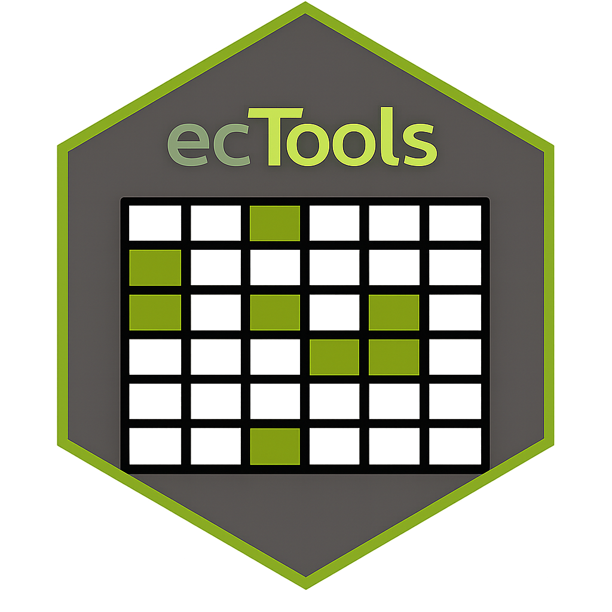

<!-- README.md is generated from README.Rmd. Please edit that file -->

# ecTools 

<!-- badges: start -->

[](https://www.codefactor.io/repository/github/ninanor/ectools)
[](https://github.com/NINAnor/ecTools/actions/workflows/R-CMD-check.yaml)

<!-- badges: end -->

The goal of ecTools is to provide tools for creating ecosystem accounts and assessment.

## eaTools = ecTools
The package was renames ecTools in may 2026.

## Installation

You can install the development version of eaTools from
[GitHub](https://github.com/) with:

``` r
# install.packages("devtools")
devtools::install_github("NINAnor/ecTools")
```
